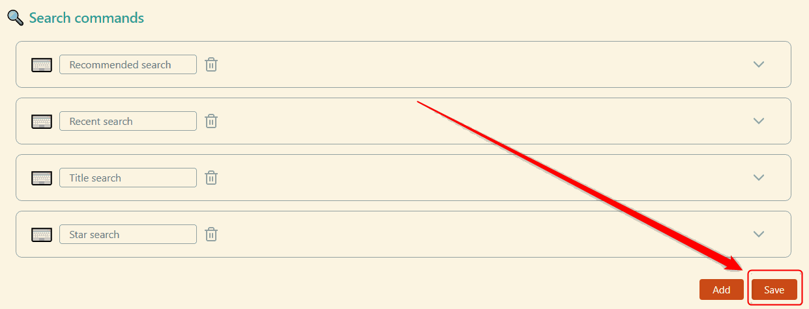

# Obsidian Another Quick Switcher Plugin

[](https://github.com/tadashi-aikawa/obsidian-another-quick-switcher/releases/latest)
[](https://github.com/tadashi-aikawa/obsidian-another-quick-switcher/actions)


This is an Obsidian plugin which is another choice of Quick switcher.

- It can create custom search commands (`Custom searches`)
- It can search backlinks and move them **without leaving from a keyboard** (`Backlink search`)
- It can move a file to another folder (`Move file to another folder`)
- It can search **regardless of the appearance order of tokens**
- It **only searches Markdown files** except for the case of `Move file to another folder`
- It does not search very fuzzy (e.g. searching for `201` doesn't match `2.01`) 
- It can search to **consider prefix emoji**
- It shows file names and directory names separately


## 👥 For users

### Feature requests / Bugs

Please create a new [issue].

### Pull requests

Before creating a pull request, please make an [issue] or a [discussion]😉

[issue]: https://github.com/tadashi-aikawa/obsidian-another-quick-switcher/issues
[discussion]: https://github.com/tadashi-aikawa/obsidian-another-quick-switcher/discussions

## ⏬ Install

You can download from `Community plugins` in Obsidian settings.

## ⌨️Features

### 1. Custom searches


Custom searches enables you to create your original search commands.


#### Sort priorities

You can use the following names as a `Sort priorities`.

| Name               | Description                                            |
| ------------------ | ------------------------------------------------------ |
| Perfect word match | A query matches perfectly with a word in the file name |
| Prefix name match  | The file name or alias starts with a query             |
| Name match         | The file name or alias includes a query                |
| Tag match          | The tag name in the file includes a query              |
| Header match       | The header name in the file includes a query           |
| Link match         | The internal link name in the file includes a query    |
| Length             | Length of the file name or alias                       |
| Last opened        | The time the file opened last                          |
| Last modified      | The time the file modified last                        |
| Star               | The file has a star                                    |
| Alphabetical       | File name or alias order by alphabetically ascend      |

> **Warning**
> Please don't forget to click the `Save` button before you close Obsidian. Otherwise, the settings **will never restore** when you open Obsidian next time.
> 

#### Only v7.0.0-beta

| Name                  | Description                                        |
| --------------------- |----------------------------------------------------|
| Alphabetical reverse  | File name or alias order by alphabetically descend |
| (Tags split by comma) | The file has specific tags                         |

> **Note**
> Examples of `(Tags spit by comma)` are `#hoge`, `#hoge,#huga`, and so on.

### 2. Backlink search


### 3. Header floating search in file / Header search in file


- Show all headers even after filtering to retain file structures in the brain
- Jump to the first hit suggestion automatically and move next/previous by `Tab/Shift+Tab` as default

### 4. Grep

This feature requires [ripgrep](https://github.com/BurntSushi/ripgrep) that can call from anywhere. In other words, the `rg --version` command must be in a state to succeed everywhere.


- `TAB`: Search (not realtime)
- `Ctrl+,`: preview
- Input regards as a regex pattern
- Because ripgrep search just fastly when you need to search, **it needs no indexes and caches, of course, no need to create them before!** ✨

## For users who use earlier than v6.0.0

v6.0.0 has some breaking changes related to commands and settings.

### Commands

These commands were removed or renamed command ids.

1. Normal search
2. Recommended recent search
3. Recent search
4. Filename recent search
5. Star Recent Search

If you want to use commands precisely the same as before, please look to the old [README](https://github.com/tadashi-aikawa/obsidian-another-quick-switcher/blob/c54890d2375a556031a0c69256624eb0fe42e266/README.md#1%E2%83%A3-file-searches) and set the priorities as the same.

> **Note**
> Example for "Normal search"
> 

### Settings

|                            Before                             |                              After                               |
| ------------------------------------------------------------- | ---------------------------------------------------------------- |
| `Search by headers`                                           | in `Search commands`                                             |
| `Search by links`                                             | in `Search commands`                                             |
| `Ignore prefix path patterns for Normal search`               | in `Search commands`                                             |
| `Ignore prefix path patterns for Recent search`               | in `Search commands`                                             |
| `Ignore prefix path patterns for Filename Recent search`      | in `Search commands`                                             |
| `Ignore prefix path patterns for Backlink search`             | `Exclude prefix path patterns for "Backlink search"`             |
| `Ignore prefix path patterns for Move file to another folder` | `Exclude prefix path patterns for "Move file to another folder"` |

## 📱 Mobile support

It both supports desktop and mobile.

## 🖥️ For developers

- Requirements
  - [Task]

### Development

```console
task init
task dev
```

### Release

```console
# Beta
task release-beta VERSION=1.2.3-beta1

# Stable
task release VERSION=1.2.3
```

[task]: https://github.com/go-task/task
