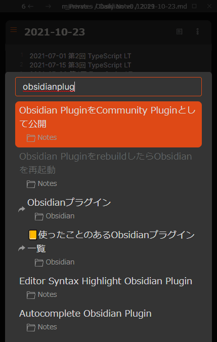
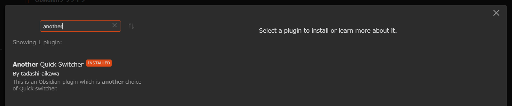

# Obsidian Another Quick Switcher Plugin

[](https://github.com/tadashi-aikawa/obsidian-another-quick-switcher/releases/latest)
[](https://github.com/tadashi-aikawa/obsidian-another-quick-switcher/actions)


This is an Obsidian plugin which is another choice of Quick switcher.
- It can search **regardless of the appearance order of tokens**
- It shows suggestions order by prioritizing both last opened time and modified time **even after typing** (`Recent search`)
- It can search backlinks and move them **without leaving from a keyboard** (`Backlink search`)
- It can search **by tags** even if queries don't start with `#`
  - When you input queries start with `#`, It priors tag
- It can search **from headers**
- It can move a file to another folder (`Move file to another folder`)
- It can search to **consider prefix emoji**
- It **only searches Markdown files** except for the case of `Move file to another folder`
- It does not search very fuzzy
- It shows file names and directory names separately

At the moment, there are only a few options. However, if you would like to customize behavior, I will add options to make it better as well as I can :)

## 👥 For users

### Feature requests / Bugs

Please create a new [issue].

### Questions / Others

Please create a new [discussion].

### Pull requests

Before creating a pull request, please make an [issue] or a [discussion]😉

[issue]: https://github.com/tadashi-aikawa/obsidian-another-quick-switcher/issues
[discussion]: https://github.com/tadashi-aikawa/obsidian-another-quick-switcher/discussions


## ⌨️Features

### Normal Search

One of the following.

- Run `Another Quick Switcher: Normal search` on `Command palette`
- Push `Ctrl/Cmd + Shift + P` in the default case
- Search query starts with `:n ` like `:n hoge`


### Recent Search

One of the following.

- Run `Another Quick Switcher: Recent search` on `Command palette`
- Push `Ctrl/Cmd + Shift + E` in the default case
- Search query starts with `:r ` like `:r hoge`


### Filename Recent Search

One of the following.

- Run `Another Quick Switcher: Filename recent search` on `Command palette`
- Push `Ctrl/Cmd + Shift + F` in the default case
- Search query starts with `:f ` like `:f hoge`

The difference with Recent Search is the sort priority order.

| Priority | Recent Search | Filename Recent Search |
| -------- | ------------- | ---------------------- |
| 1        | Last opened | **Filename matched**   |
| 2        | Last modified   | Last opened          |
| 3        | -             | Last modified            |

### Star Recent Search

One of the following.

- Run `Another Quick Switcher: Star recent search` on `Command palette`
- Search query starts with `:s ` like `:s hoge`

The difference with Recent Search is the sort priority order.

| Priority | Recent Search | Star Recent Search |
| -------- | ------------- | ------------------ |
| 1        | Last opened   | **Starred**        |
| 2        | Last modified | Last opened        |
| 3        | -             | Last modified      |
| 4        | -             | Filename matched   |

### Backlink Search

One of the following.

- Run `Another Quick Switcher: Backlink search` on `Command palette`
- Push `Ctrl/Cmd + Shift + H` in the default case
- Search query starts with `:b ` like `:b hoge`


### Header search in file

Run `Another Quick Switcher: Header search in file` on `Command palette`.


- Show all headers even after filtering to retain file structures in the brain
- Jump to the first hit suggestion automatically and move next/previous by `Tab/Shift+Tab` as default

### Move file to another folder

One of the following.

- Run `Another Quick Switcher: Move file to another folder` on `Command palette`
- Push `Ctrl/Cmd + Shift + M` in the default case


### Hotkeys on quick switcher

> **Warning**  
> `open in popup` and `create in popup` need the [Obsidian Hover Editor](https://github.com/nothingislost/obsidian-hover-editor) plugin. It doesn't support as an official feature, so there is a possibility that it will not to working someday.

| Key                       | Description               |
| ------------------------- | ------------------------- |
| `[↑↓]`                  | navigate                  |
| `[ctrl/cmd n or p]`       | navigate (for emacs user) |
| `[ctrl/cmd j or k]`       | navigate (for vimmer)     |
| `[ctrl/cmd 1~9]`         | open selection     |
| `[ctrl/cmd d]`            | clear input               |
| `[tab]`                   | replace input             |
| `[↵]`                    | open                      |
| `[ctrl/cmd ↵]`           | open in new pane          |
| `[ctrl/cmd alt ↵]`       | open in popup             |
| `[shift ↵]`              | create                    |
| `[ctrl/cmd shift ↵]`     | create in new pane        |
| `[ctrl/cmd shift alt ↵]` | create in popup           |
| `[alt ↵]`                | insert to editor          |
| `[esc]`                   | dismiss                   |

## 📱 Mobile support

It both supports desktop and mobile.



## ⏬ Install

You can download from `Community plugins` in Obsidian settings.



## 🖥️ For developers

- Requirements
  - [Task]

### Development

```console
task init
task dev
```

### Release

```console
# Beta
task release-beta VERSION=1.2.3-beta1

# Stable
task release VERSION=1.2.3
```

[task]: https://github.com/go-task/task
