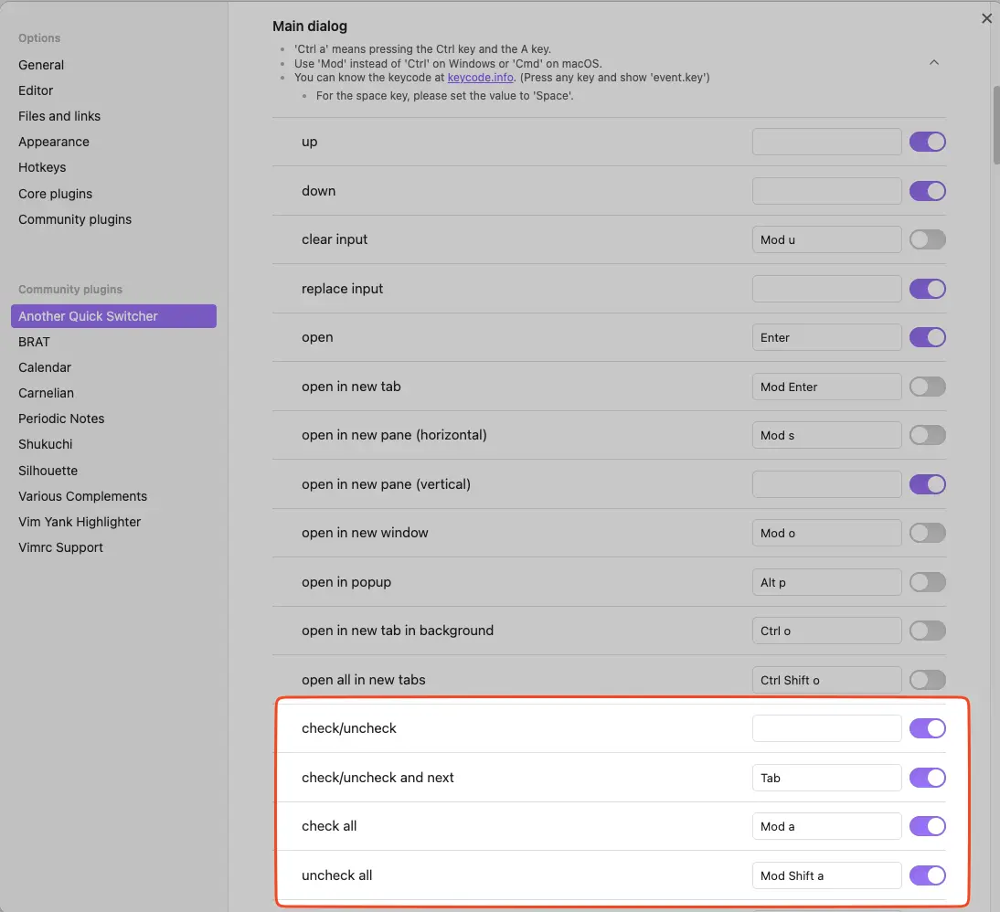
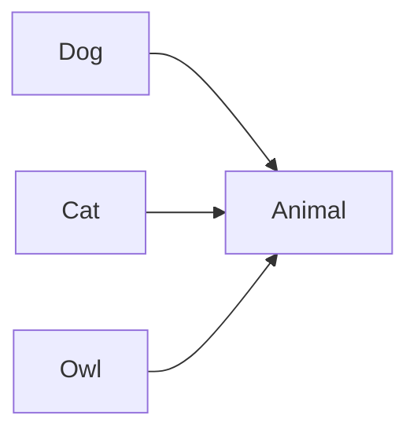
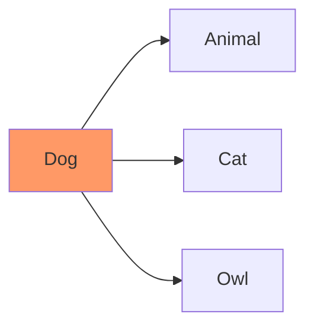
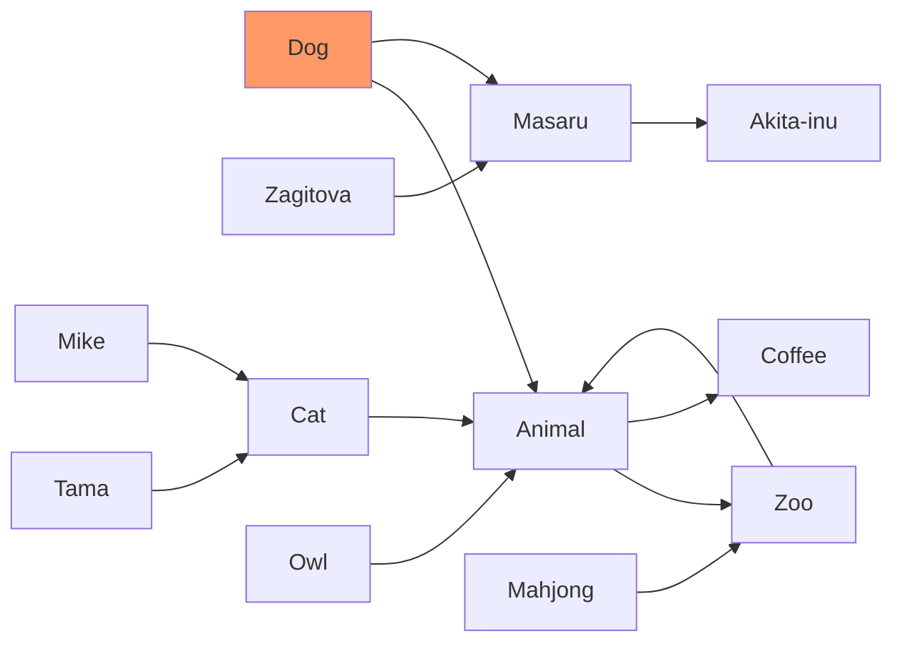
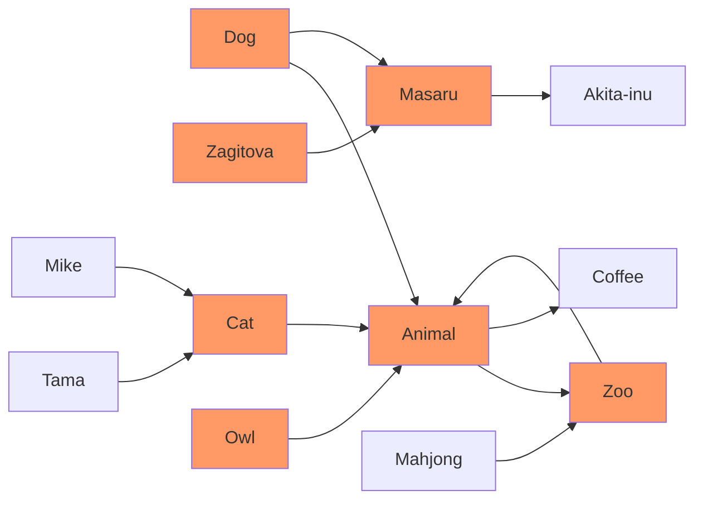

# Obsidian Another Quick Switcher Plugin

[](https://github.com/tadashi-aikawa/obsidian-another-quick-switcher/releases/latest)
[](https://deepwiki.com/tadashi-aikawa/obsidian-another-quick-switcher)
[](https://github.com/tadashi-aikawa/obsidian-another-quick-switcher/actions)


This is an Obsidian plugin which is another choice of Quick switcher. It offers various features, such as:

- 🔎 **Search commands & ranking**
  - [Create custom search commands (`Custom searches`)](#1-custom-searches)
  - Token-order-independent matching
  - Default to non-fuzzy matching; optional fuzzy search available
  - Prefix emoji-aware search
  - [Show relative updated period (last modified/created/property) in suggestions (`Custom searches`)](#relative-updated-period-display)
- 🧭 **Dialogs & search modes**
  - [Header floating search / Header search in file](#2-header-floating-search-in-file-header-search-in-file)
  - [Backlink search with line context](#5-backlink-search)
  - [Link search with line context](#6-link-search)
  - [In-file search](#7-in-file-search)
  - [Grep (ripgrep-powered content search)](#3-grep)
- 🧠 **Preview & navigation**
  - [Preview notes without closing the dialog](#10-preview)
  - [Auto preview across dialogs](#auto-preview)
  - [Show backlinks from the dialog](#8-show-backlinks-from-the-dialog)
  - [Navigate outgoing/backlinks without leaving the dialog](#9-navigate-outgoingbacklinks-without-leaving-the-dialog)
- ✅ **Batch actions**
  - [Multi-select (check/uncheck) with batch open/insert/close](#12-checkuncheck-items-multi-select)
- 📂 **File & folder tools**
  - [Move file to another folder](#11-move-file-to-another-folder)
  - Reveal a folder in the file tree (`Reveal a folder in the file tree`)
- ⌨️ **Dialog commands & hotkeys**
  - [100+ dialog commands across dialogs (open/preview/navigate/insert/etc.)](#dialog-commands)
  - [Customize hotkeys for dialog commands](#4-customizable-hotkeys)
- 🧩 **Command palette**
  - [Command palette that prioritizes results using your query history and past selections (`Command palette`)](#13-command-palette)
- 🪟 **UI/Display**
  - Show file names and directory names separately

## ⏬ Install

You can download from `Community plugins` in Obsidian settings.

## ⌨️ Features

### 1. Custom searches


Custom searches enables you to create your original search commands.
Search command settings are saved automatically when you finish editing (no Save button required).


#### Search target


| Name                               | Description                                          |
| ---------------------------------- | ---------------------------------------------------- |
| file                               | All files in the Vault                               |
| backlink                           | Markdown files that link to the current file         |
| link                               | Files linked from the current file                   |
| [2-hop-link]                       | 2-hop links from the current file                    |
| opened file                        | Files currently open in the window                   |


#### Sort priorities

You can use the following names as a `Sort priorities`.

| Name                        | Description                                               | Since   |
| --------------------------- | --------------------------------------------------------- | ------- |
| Perfect word match          | Matches an exact word in the file name                    | 6.0.0   |
| Prefix name match           | Matches when the file name or alias starts with the query | 6.0.0   |
| Name match                  | Matches when the file name or alias contains the query    | 6.0.0   |
| Fuzzy name match            | Fuzzy matches the file name or alias                      | 8.10.0  |
| Tag match                   | Matches when the query includes a tag name                | 6.0.0   |
| Header match                | Matches when the query includes a header name             | 6.0.0   |
| Link match                  | Matches when the query includes an internal link name     | 6.0.0   |
| Property match              | Matches when the query includes a property name           | 11.0.0  |
| Length                      | Orders by file name or alias length                       | 6.0.0   |
| Last opened                 | Orders by most recently opened                            | 6.0.0   |
| Last modified               | Orders by most recently modified                          | 6.0.0   |
| Star                        | Orders starred files first                                | 6.0.0   |
| Alphabetical                | Orders by file name or alias (A-Z)                        | 6.2.0   |
| Alphabetical reverse        | Orders by file name or alias (Z-A)                        | 7.0.0   |
| Created latest              | Orders by newest creation date                            | 7.0.0   |
| Created earliest            | Orders by oldest creation date                            | 7.0.0   |
| (Tags split by comma)       | Prioritizes files with the specified tags                 | 7.0.0   |
| (Extensions split by comma) | Prioritizes files with the specified extensions           | 8.3.0   |
| (Property and sort order)   | Orders by front matter property value                     | 13.27.0 |


> **Note**
> Use `(Tags split by comma)` like `#hoge` or `#hoge,#huga`.

> **Note**
> Use `(Extensions split by comma)` like `.md` or `.md,.canvas`.

> **Note**
> Use `(Property)` like `@<property>` (`@<property>:asc`) or `@<property>:desc` for descending order. For arrays, the first element is used; missing values sort last.

#### Relative updated period display

You can show the relative updated period in suggestions. Configure it per search command.

- Select the source in `Relative updated period source` (do not show / last modified / created time / property)
- When using `Property`, set the front matter key in `Property key for relative updated period`

#### Preset search commands

<details>
  <summary>Recent search</summary>
  
</details>

<details>
  <summary>File name search</summary>
  
</details>

<details>
  <summary>File name fuzzy search</summary>
  
</details>

<details>
  <summary>Landmark search</summary>
  
</details>

<details>
  <summary>Star search</summary>
  
</details>

<details>
  <summary>2 hop link search</summary>
  
</details>

#### Note

##### Queries enclosed in double quotes are searched as is

- `"ho ge"` matches only `ho ge` and does not match `hoge`.
- `ho ge` matches both `ho ge` and `hoge`.
- Use `\"` to search for literal quote characters.

##### A minus sign at the beginning excludes matched candidates  

Example: Suppose there are three files:  

- `hoge.md`  
- `hoge`  
- `mdhoge`  

The input `hoge -md` will suggest only `hoge`.  

Additionally, you can specify a custom string as the exclude prefix using the `Exclude prefix` setting.  

##### `<cd>` means the current directory

If the path of the active file is "/usr/local/vault/notes", the query "`<cd>` obsidian" will be interpreted as "/usr/local/vault/notes obsidian".

### 2. Header floating search in file / Header search in file


- Show all headers even after filtering to retain file structures in the brain
- Jump to the first hit suggestion automatically and move next/previous by `Tab/Shift+Tab` as default
- Queries enclosed in double quotes are searched as is
    - `"ho ge"` only matches `ho ge` not `hoge`
    - `ho ge` matches both `ho ge` and `hoge`
    - Use `\"` to search for literal quote characters

If you want to show heading level labels (H1/H2, etc.) instead of bullets in header search, you can do so with CSS.

<details>
  <summary>CSS: Show heading level labels (H1-H6)</summary>

```css
.another-quick-switcher__item__title__header {
  list-style: none;
}
.another-quick-switcher__item__title__header::before {
  padding-right: 5px;
  font-weight: bold;
  color: darkcyan;
  opacity: 0.4;
}
.another-quick-switcher__item__title__header1::before {
  content: "H1";
}
.another-quick-switcher__item__title__header2::before {
  content: "H2";
}
.another-quick-switcher__item__title__header3::before {
  content: "H3";
}
.another-quick-switcher__item__title__header4::before {
  content: "H4";
}
.another-quick-switcher__item__title__header5::before {
  content: "H5";
}
.another-quick-switcher__item__title__header6::before {
  content: "H6";
}
```
</details>

### 3. Grep

This feature requires [ripgrep](https://github.com/BurntSushi/ripgrep) and set the executable command to "Ripgrep command" option.


It sorts results by modified time descending.

#### Additional hotkeys


| Command                 | Description                                      | Default Hotkey   |
| ----------------------- | ------------------------------------------------ | ---------------- |
| Search                  | Execute search                                   | `TAB`            |
| Preview                 | Preview selected file                            | `Ctrl+,`         |
| Toggle input focus      | Switch focus between search query and path input | _(customizable)_ |
| Previous search history | Move to the previous query in history            | _(customizable)_ |
| Next search history     | Move to the next query in history                | _(customizable)_ |
| Clear input             | Clear the search query input                     | _(customizable)_ |
| Clear path              | Clear the path input                             | _(customizable)_ |
| Set ./ to path          | Set current directory to path input              | _(customizable)_ |


**Note**: If you want to search in real-time, please set the "Grep search delay milli-seconds" option to 1 or more.

#### Launch Grep from Quick Switcher

You can launch the Grep dialog directly from the main Quick Switcher with the current query carried over. This allows for seamless transition from file searching to content searching.

- Configure the hotkey for "launch grep" in the main dialog settings
- The current search query will be automatically transferred to the Grep dialog

#### Note

- Input regards as a regex pattern
- Grep searches only markdown files as default. If you want to search for other extensions, please update the "Grep > Extensions" settings
- If you want to include file names in the search, enable the "Include file name in search" setting
- Space-separated terms are searched with AND logic (e.g., `hello world` finds content containing both "hello" and "world")

### 4. Customizable hotkeys

Detailed hotkeys customization is available for each dialog.


### 5. Backlink search

The new Backlink search enables displaying all occurrences in the same file and listing the corresponding lines' text.

https://github.com/tadashi-aikawa/obsidian-another-quick-switcher/assets/9500018/0ce0111a-7481-40a0-a49e-ab00a2f37b35

### 6. Link search

The new Link search enables displaying all occurrences in the same file and listing the corresponding lines' text.

https://github.com/tadashi-aikawa/obsidian-another-quick-switcher/assets/9500018/b31034e7-7ad7-4ab5-8294-6b4950efe224

### 7. In file search

"In File search" allows you to search for a specific line within a file using a search keyword and displays it along with the surrounding lines.

- Queries enclosed in double quotes are searched as is
    - `"hello world"` only matches `hello world` not lines containing both `hello` and `world` separately
    - `hello world` matches lines containing both `hello` and `world` anywhere in the line
    - Use `\"` to search for literal quote characters (e.g., `search \"quote` finds `search "quote`)

#### Additional Features

- **Insert to Editor**: You can insert the selected line directly into the current editor at the cursor position using the configurable "insert to editor" hotkey

https://github.com/tadashi-aikawa/obsidian-another-quick-switcher/assets/9500018/0b16c4f4-b071-4e05-9402-00ae2525e57c

### 8. Show backlinks from the dialog

You can show the backlinks about the suggestion in the dialog. (Default hotkey is `Mod h`)

It can show backlinks from not only existing notes but also phantom(not existing) notes.


### 9. Navigate outgoing/backlinks without leaving the dialog

You can navigate outgoing/backlinks without leaving the dialog by using the "show links", "show backlinks", "navigate forward", and "navigate back" commands.


### 10. Preview

You can preview the file without closing the dialog. (Default hotkey is `Mod ,`)

While previewing, you can scroll the note with `scroll preview up` / `scroll preview down` (hotkeys are configurable). It also responds to scrolling from pointing devices.

It shows a floating view that doesn't distract the contents. Additionally, it makes the editor state before opening the dialog after previewing files and closing the dialog.

https://user-images.githubusercontent.com/9500018/216806330-daf57b52-d8a4-42e3-9803-ba7d76a93319.mp4

#### Auto Preview

Auto Preview shows a preview automatically as you move the selection, without manually triggering Preview.

| Dialog | Auto preview on selection | Delay setting | Toggle command | Notes |
| ------ | ------------------------- | ------------- | -------------- | ----- |
| Main dialog (search commands) | Yes (per command) | Yes | Yes (`toggle auto preview`) | Configured per search command |
| Grep dialog | Yes | Yes | No | Enable in settings |
| Backlink dialog | Yes | Yes | No | Enable in settings |
| Header dialog | Yes | No | Yes (`toggle auto preview`) | Auto preview uses floating mode |
| Link dialog | Yes | No | Yes (`toggle auto preview`) | Auto preview uses floating mode |
| In File dialog | Yes | No | Yes (`toggle auto preview`) | Auto preview uses floating mode |

Settings reference (UI labels):

- Main dialog (search commands): `Auto preview`, `Auto preview delay milli-seconds`
- Grep dialog: `Auto preview`, `Auto preview delay milli-seconds`
- Backlink dialog: `Auto preview`, `Auto preview delay milli-seconds`
- Header dialog: `Auto preview in the floating mode`
- Link dialog: `Auto preview in the floating mode`
- In File dialog: `Auto preview in the floating mode`

<div style="text-align: center">🎥 <b>Demo movie (YouTube)</b>👇</div>

[](https://www.youtube.com/watch?v=i8b6pHrhIb4)


### 11. Move file to another folder

The "Move file to another folder" command allows you to quickly move the current file to a different folder with enhanced sorting capabilities and smart search features.

#### Search Features

- **Fuzzy Search**: Find folders even with partial or out-of-order characters (e.g., "proj" matches "Projects")
- **Highlighted Matches**: Search terms are highlighted in both folder names and directory paths
- **Multiple Match Types**: Supports prefix matching, substring matching, and fuzzy matching
- **Vault root entry**: The vault root appears as `<VAULT_ROOT>` so you can move files directly to the root

#### Folder Sort Options


| Option               | Description                                              |
| -------------------- | -------------------------------------------------------- |
| Recently used        | Folders you've recently moved files to appear at the top |
| Alphabetical         | Sort folders alphabetically (A-Z)                        |
| Alphabetical reverse | Sort folders in reverse alphabetical order (Z-A)         |


#### Settings


| Setting                         | Description                                                    | Default          |
| ------------------------------- | -------------------------------------------------------------- | ---------------- |
| Folder sort priority            | Choose how folders are sorted in the move dialog               | Recently used    |
| Recently used folders file path | Customize where the folder usage history is stored<sup>*</sup> | _(auto)_         |
| Max recently used folders       | Maximum number of recently used folders to remember            | 10 (range: 5-50) |
| Exclude prefix path patterns    | Exclude certain folder paths from appearing in the move dialog | _(none)_         |

<sup>*</sup> When left empty, defaults to `.obsidian/plugins/obsidian-another-quick-switcher/recently-used-folders.json`

#### Features

- **Recently used folder tracking**: The plugin remembers which folders you've used recently and prioritizes them
- **Persistent history**: Recently used folder history is stored in your vault and syncs across devices
- **Configurable storage**: Customize where the folder usage history is stored within your vault

### 12. Check/Uncheck items (multi-select)

You can multi-select suggestions in the main Quick Switcher, Backlink search, and Grep.

- Toggle selection: use the configurable hotkeys "check/uncheck" or "check/uncheck and next" (moves the cursor to the next item).
- Select all / Clear all: use "check/uncheck all" (toggles all) or "uncheck all" hotkeys (configurable).
- Checked-count badge: shows how many items are checked next to the input while using multi-select.
- Visual cue: checked items show a left accent bar in the list.
- Batch actions: when items are checked, actions like Open will apply to all checked items. For example, Open opens all checked targets in new tabs; other supported actions (e.g., close if opened, open in default app, show in system explorer) also work for checked items.

<div style="text-align: center">🎥 <b>Demo movie (YouTube)</b>👇</div>

[](https://www.youtube.com/watch?v=IPHZu87sd2w)

Tip: Assign convenient keys in Settings to quickly mark a range (e.g., bind "check/uncheck and next").




### 13. Command palette

Another Quick Switcher bundles its own command palette dialog so you can search and execute Obsidian commands with the same fast scoring model and dialog hotkeys.

- The palette remembers every command you run and surfaces recently used commands with a history badge
- It also records which command you picked for the current query and marks that command as "top priority" the next time you type the same query
- Use the `copy command id` hotkey to quickly grab an internal command ID for automation or scripting

https://github.com/user-attachments/assets/eb2bf1bc-08b8-4084-b4b7-450d737b8e95

#### History storage


| Setting                    | Description                                                                                         | Default                                                                  |
| -------------------------- | --------------------------------------------------------------------------------------------------- | ------------------------------------------------------------------------ |
| History mapping file path  | Vault-relative path for the JSON file that stores last used commands and per-query favorites        | `.obsidian/plugins/obsidian-another-quick-switcher/command-history.json` |
| Max history retention days | Remove entries from the history when a command hasn't been run within this many days (0 = keep all) | 10                                                                       |


## ⌘ Dialog Commands

Below are dialog-specific command tables with default keybindings.

The MC column indicates multi-check support: "✅" applies to all checked items, "⛔" affects only the current selection, and "-" is not applicable (e.g., toggle commands).

### Main dialog


| Command                         | Default Keybinding | MC |
| ------------------------------- | ------------------ | -- |
| open                            | `Enter`            | ✅  |
| open in new tab                 | `Mod+Enter`        | ✅  |
| open in new pane (horizontal)   | `Mod+-`            | ✅  |
| open in new pane (vertical)     | `Mod+i`            | ✅  |
| open in new window              | `Mod+o`            | ⛔  |
| open in popup                   | _(none)_           | ⛔  |
| preview                         | `Mod+,`            | ⛔  |
| toggle auto preview             | _(none)_           | -  |
| scroll preview up               | _(none)_           | ⛔  |
| scroll preview down             | _(none)_           | ⛔  |
| create                          | `Shift+Enter`      | ⛔  |
| create in new tab               | `Mod+Shift+Enter`  | ⛔  |
| create in new pane (horizontal) | _(none)_           | ⛔  |
| create in new pane (vertical)   | _(none)_           | ⛔  |
| create in new window            | `Mod+Shift+o`      | ⛔  |
| create in new popup             | _(none)_           | ⛔  |
| check/uncheck                   | _(none)_           | -  |
| check/uncheck and next          | _(none)_           | -  |
| check/uncheck all               | _(none)_           | -  |
| uncheck all                     | _(none)_           | -  |
| insert to editor                | `Alt+Enter`        | ✅  |
| open in default app             | _(none)_           | ✅  |
| show in system explorer         | _(none)_           | ✅  |
| open in google                  | `Mod+g`            | ⛔  |
| open first URL                  | `Mod+]`            | ✅  |
| close if opened                 | _(none)_           | ✅  |
| show links                      | `Mod+l`            | ⛔  |
| show backlinks                  | `Mod+h`            | ⛔  |
| show all results                | `Shift+Alt+a`      | ⛔  |
| navigate back                   | `Alt+ArrowLeft`    | ⛔  |
| navigate forward                | `Alt+ArrowRight`   | ⛔  |
| previous search history         | _(none)_           | ⛔  |
| next search history             | _(none)_           | ⛔  |
| launch grep                     | _(none)_           | ⛔  |
| copy file vault path            | _(none)_           | ⛔  |
| copy absolute file path         | _(none)_           | ⛔  |
| up                              | `Mod+p`            | ⛔  |
| down                            | `Mod+n`            | ⛔  |
| clear input                     | `Mod+d`            | ⛔  |
| replace input                   | `Tab`              | ⛔  |
| dismiss                         | `Escape`           | ⛔  |


### Folder dialog


| Command             | Default Keybinding | MC |
| ------------------- | ------------------ | -- |
| up                  | `Mod+p`            | ⛔  |
| down                | `Mod+n`            | ⛔  |
| open in default app | _(none)_           | ⛔  |
| dismiss             | `Escape`           | ⛔  |


### Header dialog


| Command              | Default Keybinding | MC |
| -------------------- | ------------------ | -- |
| up                   | `Mod+p`            | ⛔  |
| down                 | `Mod+n`            | ⛔  |
| clear input          | `Mod+d`            | ⛔  |
| move to next hit     | `Tab`              | ⛔  |
| move to previous hit | `Shift+Tab`        | ⛔  |
| toggle auto preview  | `Mod+,`            | ⛔  |
| scroll preview up    | _(none)_           | ⛔  |
| scroll preview down  | _(none)_           | ⛔  |
| insert all to editor | `Alt+Shift+Enter`  | ⛔  |
| dismiss              | `Escape`           | ⛔  |


### Backlink dialog


| Command                       | Default Keybinding | MC |
| ----------------------------- | ------------------ | -- |
| open                          | `Enter`            | ✅  |
| open in new tab               | `Mod+Enter`        | ✅  |
| open in new pane (horizontal) | `Mod+-`            | ✅  |
| open in new pane (vertical)   | `Mod+i`            | ✅  |
| open in new window            | `Mod+o`            | ⛔  |
| open in popup                 | _(none)_           | ⛔  |
| check/uncheck                 | _(none)_           | -  |
| check/uncheck and next        | _(none)_           | -  |
| check/uncheck all             | _(none)_           | -  |
| uncheck all                   | _(none)_           | -  |
| show all results              | `Shift+Alt+a`      | ⛔  |
| preview                       | `Mod+,`            | ⛔  |
| scroll preview up             | _(none)_           | ⛔  |
| scroll preview down           | _(none)_           | ⛔  |
| up                            | `Mod+p`            | ⛔  |
| down                          | `Mod+n`            | ⛔  |
| dismiss                       | `Escape`           | ⛔  |


### Link dialog


| Command                       | Default Keybinding | MC |
| ----------------------------- | ------------------ | -- |
| open                          | `Enter`            | ⛔  |
| open in new tab               | `Mod+Enter`        | ⛔  |
| open in new pane (horizontal) | `Mod+-`            | ⛔  |
| open in new pane (vertical)   | `Mod+i`            | ⛔  |
| open in new window            | `Mod+o`            | ⛔  |
| open in popup                 | _(none)_           | ⛔  |
| show all results              | `Shift+Alt+a`      | ⛔  |
| preview                       | `Mod+,`            | ⛔  |
| toggle auto preview           | _(none)_           | -  |
| scroll preview up             | _(none)_           | ⛔  |
| scroll preview down           | _(none)_           | ⛔  |
| up                            | `Mod+p`            | ⛔  |
| down                          | `Mod+n`            | ⛔  |
| dismiss                       | `Escape`           | ⛔  |


### In File dialog


| Command            | Default Keybinding | MC |
| ------------------ | ------------------ | -- |
| up                 | `Mod+p`            | ⛔  |
| down               | `Mod+n`            | ⛔  |
| insert to editor   | _(none)_           | ⛔  |
| show all results   | `Shift+Alt+a`      | ⛔  |
| toggle auto preview| `Mod+,`            | ⛔  |
| scroll preview up  | _(none)_           | ⛔  |
| scroll preview down| _(none)_           | ⛔  |
| dismiss            | `Escape`           | ⛔  |


### Grep dialog


| Command                       | Default Keybinding | MC |
| ----------------------------- | ------------------ | -- |
| open                          | `Enter`            | ✅  |
| open in new tab               | `Mod+Enter`        | ✅  |
| open in new pane (horizontal) | `Mod+-`            | ✅  |
| open in new pane (vertical)   | `Mod+i`            | ✅  |
| open in new window            | `Mod+o`            | ⛔  |
| open in popup                 | _(none)_           | ⛔  |
| check/uncheck                 | _(none)_           | -  |
| check/uncheck and next        | _(none)_           | -  |
| check/uncheck all             | _(none)_           | -  |
| uncheck all                   | _(none)_           | -  |
| preview                       | `Mod+,`            | ⛔  |
| scroll preview up             | _(none)_           | ⛔  |
| scroll preview down           | _(none)_           | ⛔  |
| clear input                   | `Mod+d`            | ⛔  |
| clear path                    | `Alt+d`            | ⛔  |
| set ./ to path                | `Alt+c`            | ⛔  |
| toggle input                  | _(none)_           | ⛔  |
| previous search history       | _(none)_           | ⛔  |
| next search history           | _(none)_           | ⛔  |
| up                            | `Mod+p`            | ⛔  |
| down                          | `Mod+n`            | ⛔  |
| search                        | `Tab`              | ⛔  |
| dismiss                       | `Escape`           | ⛔  |


### Command palette


| Command         | Default Keybinding | MC |
| --------------- | ------------------ | -- |
| up              | `Mod+p`            | ⛔  |
| down            | `Mod+n`            | ⛔  |
| copy command id | _(none)_           | ⛔  |
| dismiss         | `Escape`           | ⛔  |


## 💥 Major Breaking Changes

### For users who use earlier than v14.0.0

The following commands were removed to avoid conflicts with preview:

- `open in new tab in background`
- `open all in new tabs`
- `insert to editor in background`
- `insert all to editor`

The first two were removed from the main/backlink/link/grep dialogs; the last two were removed from the main dialog.

Alternatives with multi-select:

- `open in new tab in background` -> use `check/uncheck` for multiple selection and run `open`
- `open all in new tabs` -> use `check/uncheck all` to select all and run `open`
- `insert to editor in background` -> use `check/uncheck` for multiple selection and run `insert to editor`
- `insert all to editor` -> use `check/uncheck all` to select all and run `insert to editor`

<div style="text-align: center">🎥 <b>Demo movie (YouTube)</b>👇</div>

[](https://www.youtube.com/watch?v=sxDEMQq8txc)


### For users who use earlier than v13.0.0

In v13, we removed `Link search` from `Preset search commands`. Please see #275 for details about this decision. If you need the previous `Link search` functionality, you can add it to `Search commands` with the configuration shown in the image below.

<details>
  <summary>Open "Link search" configuration</summary>
  
</details>

### For users who use earlier than v8.0.0

Please read a "🔥 Breaking changes" section in the [Release note](https://github.com/tadashi-aikawa/obsidian-another-quick-switcher/releases/tag/8.0.0).

### For users who use earlier than v7.0.0

Please read a "🔥 Breaking changes" section in the [Release note](https://github.com/tadashi-aikawa/obsidian-another-quick-switcher/releases/tag/7.0.0).

### For users who use earlier than v6.0.0

Please read a "🔥 Breaking changes" section in the [Release note](https://github.com/tadashi-aikawa/obsidian-another-quick-switcher/releases/tag/6.0.0).

## 📱 Mobile support

It both supports desktop and mobile.

> [!NOTE]
> Please note that I am not currently using the mobile version of Obsidian, so I cannot verify this issue myself. As a result, addressing this bug will have a low priority.

## 💬 Feature requests / Bugs

Please create a new [issue].

---

## 🖥️ For developers / contributors

### Pull requests

Sorry, I would not accept the pull requests except for the following cases.

1. Fix obvious bugs
2. Fix typo or wrong documentation
3. If I ask for it in the GitHub issues or the discussions

### Development

#### Set up

```bash
git config core.hooksPath hooks
```

#### Install dependencies

[Bun] is required.

```console
bun install --frozen-lockfile --ignore-scripts
bun dev
```

### Release

Run [Release Action](https://github.com/tadashi-aikawa/obsidian-another-quick-switcher/actions/workflows/release.yaml) manually.

## 📜 Appendix

### What is the "2-hop-link"?

[2-hop-link] are outgoing links in the current file, and files that have outgoing links to them.

For example, If there are relations as follows,



[2-hop-link] from the "Dog" is as follows.



More complicated example.



[2-hop-link] from the "Dog" is as follows.




[Bun]: https://bun.sh/
[issue]: https://github.com/tadashi-aikawa/obsidian-another-quick-switcher/issues
[discussion]: https://github.com/tadashi-aikawa/obsidian-another-quick-switcher/discussions

[2-hop-link]: #what-is-the-2-hop-link
