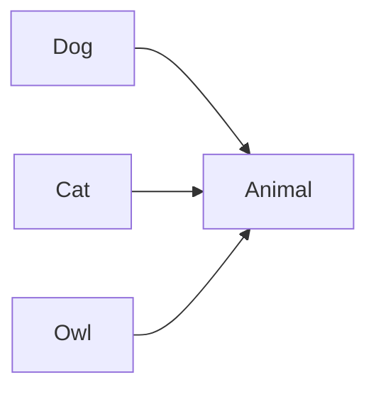
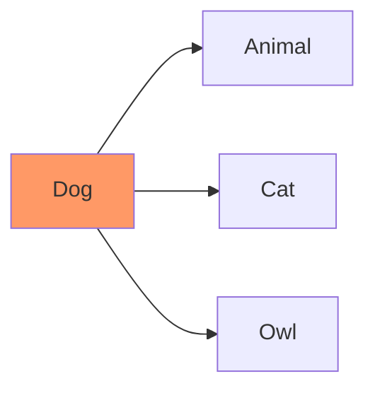
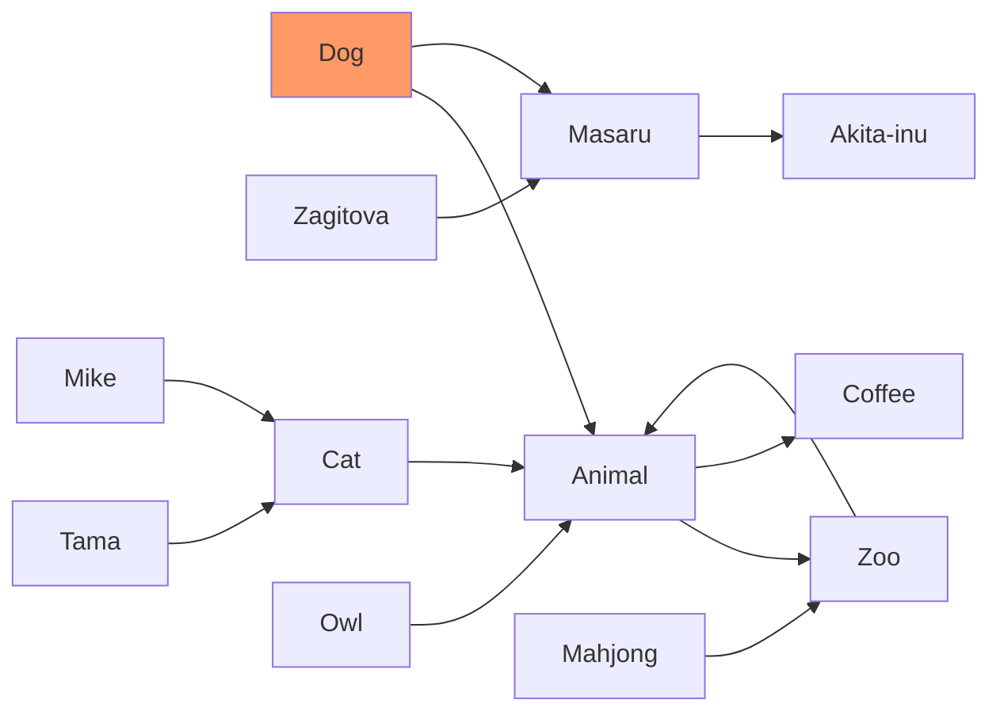
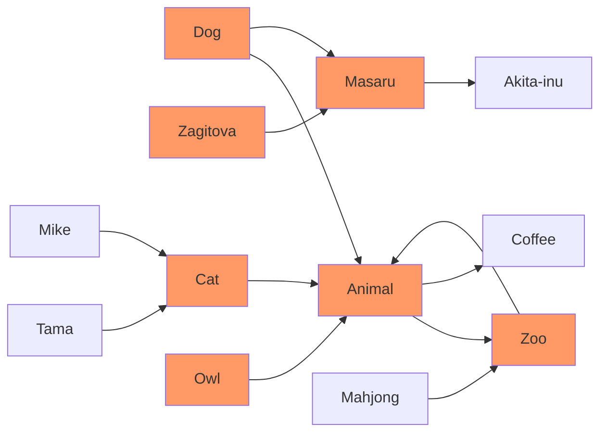

# Obsidian Another Quick Switcher Plugin

[](https://github.com/tadashi-aikawa/obsidian-another-quick-switcher/releases/latest)
[](https://github.com/tadashi-aikawa/obsidian-another-quick-switcher/actions)


This is an Obsidian plugin which is another choice of Quick switcher. It offers various features, such as:

- Creating custom search commands (`Custom searches`)
- Customizing the hotkeys in the quick switcher to your preference
- Searching backlinks and moving them **without leaving the keyboard** (`Backlink search`)
- Moving a file to another folder (`Move file to another folder`)
- Searching **regardless of the order in which tokens appear**
- Not performing very fuzzy searches by default, but an option is available to enable them
- Searching **considering prefix emoji**
- Showing file names and directory names separately
- Revealing a folder in the file tree (`Reveal a folder in the file tree`)

## ⏬ Install

You can download from `Community plugins` in Obsidian settings.

## ⌨️ Features

### 1. Custom searches


Custom searches enables you to create your original search commands.


#### Search target

| Name                               | Description                                          |
| ---------------------------------- | ---------------------------------------------------- |
| markdown                           | All markdown files                                   |
| backlink                           | Markdown files in backlinks on the current file      |
| link                               | Markdown files in outgoing links on the current file |
| [2-hop-link]                       | Markdown files in 2-hop-links from the current file  |
| opened file                        | Markdown files opened in the current window          |

#### Sort priorities

You can use the following names as a `Sort priorities`.

| Name                        | Description                                            | Since  |
| --------------------------- | ------------------------------------------------------ | ------ |
| Perfect word match          | A query matches perfectly with a word in the file name | 6.0.0  |
| Prefix name match           | The file name or alias starts with a query             | 6.0.0  |
| Name match                  | The file name or alias includes a query                | 6.0.0  |
| Fuzzy name match            | The file name or alias matches fuzzy with a query      | 8.10.0 |
| Tag match                   | The query includes the file's tag name                 | 6.0.0  |
| Header match                | The query includes the file's header name              | 6.0.0  |
| Link match                  | The query includes the file's internal link name       | 6.0.0  |
| Property match              | The query includes the file's property name            | 11.0.0 |
| Length                      | Length of the file name or alias                       | 6.0.0  |
| Last opened                 | The time the file opened last                          | 6.0.0  |
| Last modified               | The time the file modified last                        | 6.0.0  |
| Star                        | The file has a star                                    | 6.0.0  |
| Alphabetical                | File name or alias order by alphabetically ascend      | 6.2.0  |
| Alphabetical reverse        | File name or alias order by alphabetically descend     | 7.0.0  |
| Created latest              | File creation date from the latest to the earliest     | 7.0.0  |
| Created earliest            | File creation date from the earliest to the latest     | 7.0.0  |
| (Tags split by comma)       | The file has specific tags                             | 7.0.0  |
| (Extensions split by comma) | The file has specific extensions                       | 8.3.0  |

> **Warning**
> Please don't forget to click the `Save` button before you close Obsidian. Otherwise, the settings **will never restore** when you open Obsidian next time.
> 

> **Note**
> Examples of `(Tags spit by comma)` are `#hoge`, `#hoge,#huga`, and so on.

> **Note**
> Examples of `(Extensions spit by comma)` are `.md`, `.md,.canvas`, and so on.

#### Preset search commands

<details>
  <summary>Recent search</summary>
  
</details>

<details>
  <summary>File name search</summary>
  
</details>

<details>
  <summary>Landmark search</summary>
  
</details>

<details>
  <summary>Star search</summary>
  
</details>

<details>
  <summary>Backlink search</summary>
  
</details>

#### Note

##### Queries enclosed in double quotes are searched as is

- `"ho ge"` only matches `ho ge` not `hoge`
- `ho ge` matches both `ho ge` and `hoge`

##### A minus sign at the beginning excludes the matched candidates

Ex: If there are three files.

- hoge.md
- hoge
- mdhoge

`hoge -md` suggests only `hoge`.

##### `<cd>` means the current directory

If a path of the active file is "/usr/local/vault/notes", The query, "`<cd>` obsidian" will regard as "/usr/local/vault/notes obsidian".

### 2. Header floating search in file / Header search in file


- Show all headers even after filtering to retain file structures in the brain
- Jump to the first hit suggestion automatically and move next/previous by `Tab/Shift+Tab` as default
- Queries enclosed in double quotes are searched as is
    - `"ho ge"` only matches `ho ge` not `hoge`
    - `ho ge` matches both `ho ge` and `hoge`

### 3. Grep

This feature requires [ripgrep](https://github.com/BurntSushi/ripgrep) and set the executable command to "Ripgrep command" option.


It sorts results by modified time descending.

#### Default hotkeys

- `TAB`: Search (not realtime)
- `Ctrl+,`: preview

#### Note

- Input regards as a regex pattern
- Grep searches only markdown files as default. If you want to search for other extensions, please update the "Grep > Extensions" settings

### 4. Customizable hotkeys

Detailed hotkeys customization is available for each dialog.


### 5. Backlink search

The new Backlink search enables displaying all occurrences in the same file and listing the corresponding lines' text.

https://github.com/tadashi-aikawa/obsidian-another-quick-switcher/assets/9500018/0ce0111a-7481-40a0-a49e-ab00a2f37b35

### 6. Link search

The new Link search enables displaying all occurrences in the same file and listing the corresponding lines' text.

https://github.com/tadashi-aikawa/obsidian-another-quick-switcher/assets/9500018/b31034e7-7ad7-4ab5-8294-6b4950efe224

### 7. In file search

"In File search" allows you to search for a specific line within a file using a search keyword and displays it along with the surrounding lines.

https://github.com/tadashi-aikawa/obsidian-another-quick-switcher/assets/9500018/0b16c4f4-b071-4e05-9402-00ae2525e57c

### 8. Show backlinks from the dialog

You can show the backlinks about the suggestion in the dialog. (Default hotkey is `Mod h`)

It can show backlinks from not only existing notes but also phantom(not existing) notes.


### 9. Navigate outgoing/backlinks without leaving the dialog

You can navigate outgoing/backlinks without leaving the dialog by using the "show links", "show backlinks", "navigate forward", and "navigate back" commands.


### 10. Preview

You can preview the file without closing the dialog. (Default hotkey is `Mod ,`)

It shows a floating view that doesn't distract the contents. Additionally, it makes the editor state before opening the dialog after previewing files and closing the dialog.

https://user-images.githubusercontent.com/9500018/216806330-daf57b52-d8a4-42e3-9803-ba7d76a93319.mp4

## For users who use earlier than v8.0.0

Please read a "🔥 Breaking changes" section in the [Release note](https://github.com/tadashi-aikawa/obsidian-another-quick-switcher/releases/tag/8.0.0).

## For users who use earlier than v7.0.0

Please read a "🔥 Breaking changes" section in the [Release note](https://github.com/tadashi-aikawa/obsidian-another-quick-switcher/releases/tag/7.0.0).

## For users who use earlier than v6.0.0

Please read a "🔥 Breaking changes" section in the [Release note](https://github.com/tadashi-aikawa/obsidian-another-quick-switcher/releases/tag/6.0.0).

## 📱 Mobile support

It both supports desktop and mobile.

## Feature requests / Bugs

Please create a new [issue].

---

## 🖥️ For developers / contributors

### Pull requests

Sorry, I would not accept the pull requests except for the following cases.

1. Fix obvious bugs
2. Fix typo or wrong documentation
3. If I ask for it in the GitHub issues or the discussions

### Development

[Bun] is required.

```console
bun i
bun dev
```

### Release

```console
# Stable
VERSION=1.2.3 bun release

# Beta
VERSION=1.2.3-beta1 bun release
```

## Appendix

### What is the "2-hop-link"?

[2-hop-link] are outgoing links in the current file, and files that have outgoing links to them.

For example, If there are relations as follows,



[2-hop-link] from the "Dog" is as follows.



More complicated example.



[2-hop-link] from the "Dog" is as follows.




[Bun]: https://bun.sh/
[issue]: https://github.com/tadashi-aikawa/obsidian-another-quick-switcher/issues
[discussion]: https://github.com/tadashi-aikawa/obsidian-another-quick-switcher/discussions

[2-hop-link]: #what-is-the-2-hop-link
